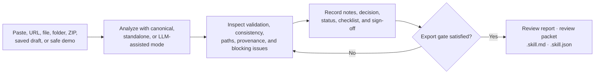

# Skill-0 Review Studio

<p align="center">
  <strong>Turn Skill-0 parser output into an evidence-aware review, decision, and export package.</strong>
</p>

<p align="center">
  <a href="./README.zh-tw.md">繁體中文</a> ·
  <a href="./docs/getting-started.md">Guided tour</a> ·
  <a href="./docs/README.md">Documentation</a> ·
  <a href="./docs/shared/02-mode-and-equivalence-contract.md">Trust contract</a>
</p>

<p align="center">
  <a href="https://github.com/pingqLIN/skill-0-GUI/actions/workflows/ci.yml"></a>
  <a href="./LICENSE"></a>
  <a href="./.github/workflows/ci.yml"></a>
</p>


Skill-0 Review Studio is the reviewer-facing workspace around
[Skill-0](https://github.com/pingqLIN/skill-0). Load one `SKILL.md`, a bundle, a
remote source, or a SkillDocument; keep parser provenance visible; record review
findings and approval state; then export review-ready Markdown and JSON
artifacts.

The studio reviews skills. It does not execute them.

## From input to review-ready evidence



### What the studio adds

| Start with the review task | Keep evidence visible | Export with context |
|---|---|---|
| Paste one skill, import a URL or bundle, restore a browser-local draft, or load a guided demo. | Inspect parser mode, validation, consistency, path-walk results, source context, and blocking issues before editing. | Preserve review status, handoff state, equivalence status, canonical rerun requirements, and draft-only markers. |

## Quick start

CI uses Node.js 20. A lockfile is included, so `npm ci` is the reproducible
setup path.

```bash
npm ci
npm run dev
```

Open:

- workspace: <http://127.0.0.1:5173/>
- guided demo entry: <http://127.0.0.1:5173/demo>

If `VITE_PORT` is set, use the port printed by Vite.

To exercise the deployable server:

```bash
npm run build
npm start
```

The production server uses `PORT=4173` by default.

## Your first review

### 1. Choose a goal and prepare the source

Select a single-skill review, bundle review, saved draft, or the demo-safe
workspace. The studio only shows inputs relevant to that goal.


### 2. Analyze, then inspect evidence before editing

Open blocking issues from the persistent review rail. Review parser mode,
source context, validation, consistency, and path evidence before changing the
document.


### 3. Complete the review gate before exporting

After resolving or accepting findings, record reviewer notes, a decision,
checklist state, handoff state, and sign-off.


Formal exports remain locked while evidence or approval is incomplete.

The screenshots above are regenerated from the real app with built-in,
demo-safe content in `standalone` mode. They demonstrate product interaction,
not canonical equivalence or production approval. See the
[step-by-step guide](docs/getting-started.md) for the exact commands and trust
boundaries.

## Core capabilities

- Task-first intake for a single skill, bundle, saved draft, or guided demo
- Paste, supported URL, file, folder, ZIP, and SkillDocument inputs
- Editable imported sources before analysis
- Canonical parser bridge when a controlled local `skill-0` checkout is available
- Self-contained standalone parser for demos and public hosting
- Optional server-side LLM-assisted recovery for unknown or sparse formats
- Validation, consistency, path-walk, provenance, and blocking-issue surfaces
- Browser-local draft persistence and draft export
- Reviewer notes, decision log, status, checklist, summary, and sign-off
- English and Traditional Chinese reviewer interface
- Standard and public builds, with optional 3D visualization excluded from the public profile

## Choose the right parser mode

| Mode | Best for | Trust statement |
|---|---|---|
| `canonical` | Controlled local review with the `skill-0` parser available | Uses the canonical parser path. Material edits may still require a canonical rerun before final approval. |
| `standalone` | Demos, portable review, and self-contained hosting | Compatibility-oriented fallback. It is not proof of strict canonical equivalence. |
| `llm-assisted` | Recovery for unknown or future formats | Draft-only. It must never be presented as final equivalence evidence. |

The UI and every export keep the active mode visible. The normative wording
lives in the [mode and equivalence contract](docs/shared/02-mode-and-equivalence-contract.md).

## Review outputs

| Output | Purpose |
|---|---|
| Review report (`.md`) | Human-readable findings, evidence posture, review status, checklist, summary, and sign-off |
| Review packet (`.json`) | Machine-readable review state and evidence for downstream tooling |
| Skill export (`.skill.md`) | Reviewed skill content with mode-aware export naming |
| SkillDocument (`.skill.json`) | Structured parser output for compatible consumers |
| Draft (`.draft.json`) | Browser-local workspace state for later continuation |

Formal review exports are gated. Standalone and LLM-assisted exports retain
their compatibility or draft-only limitations.

## Documentation

| If you want to… | Start here |
|---|---|
| Run one complete local review | [Guided tour](docs/getting-started.md) |
| Understand the product and repository boundary | [Project overview](docs/01-project-overview.md) |
| Integrate or inspect the runtime | [Runtime architecture](docs/02-runtime-and-system-architecture.md) |
| Configure canonical, standalone, or hosted operation | [Deployment and configuration](docs/06-deployment-operations-and-configuration.md) |
| Verify parser-mode claims | [Mode and equivalence contract](docs/shared/02-mode-and-equivalence-contract.md) |
| Browse every current and historical document | [Documentation hub](docs/README.md) |
| Read release-facing translations | [Multilingual release docs](docs/i18n/README.md) |

## Configuration

Most local reviews work with defaults. Common overrides are:

| Variable | Use |
|---|---|
| `VITE_PORT` | Development and preview port; defaults to `5173` |
| `PORT` | Production Express port; defaults to `4173` |
| `SKILL0_MODE` | `auto` or `standalone` parser selection |
| `SKILL0_PARSER_ROOT` | Controlled local path to the canonical `skill-0` checkout |
| `SKILL0_LLM_MODE` | `disabled`, `fallback`, or test-only `force` recovery |
| `VITE_ENABLE_3D` | Optional 3D build surface; public builds set this to `false` |

See [.env.example](.env.example) for the complete contract. Keep provider keys
server-side, never in `VITE_*` variables, source control, screenshots, or
exported review material.

## Verification

Run the smallest relevant check first, then the complete gate before merging:

```bash
npm run lint
npm test
npm run docs:check
npm run verify:build-size
npm run verify:public-build
npm run test:e2e
```

Refresh the real application screenshots with:

```bash
npm run docs:capture-screenshots
```

The capture command forces `standalone` mode, uses built-in demo-safe data, and
runs at the repo-owned Playwright viewport.

## Trust and data boundaries

- The active parser mode is review evidence and must remain visible.
- Browser-local drafts are not server-backed collaboration or durable remote storage.
- Uploaded material is processed for the active session; public hosts should assume ephemeral server storage.
- Standalone output is compatibility-oriented, not universal equivalence proof.
- LLM-assisted output is draft-only and requires a separately configured server-side provider.
- No public deployment, shared persistence, multi-user review history, or in-product GitHub PR automation is implied by this repository.

## Contributing

Keep changes scoped, preserve parser-mode wording, and add tests when behavior
changes. Shared contract files under `docs/shared/` are managed mirrors; use
`npm run docs:sync` only when updating them from the canonical source.

See [CONTRIBUTING guidance in the documentation hub](docs/README.md#contributing-and-documentation-rules)
for the review checklist.

## License

[MIT](LICENSE)
