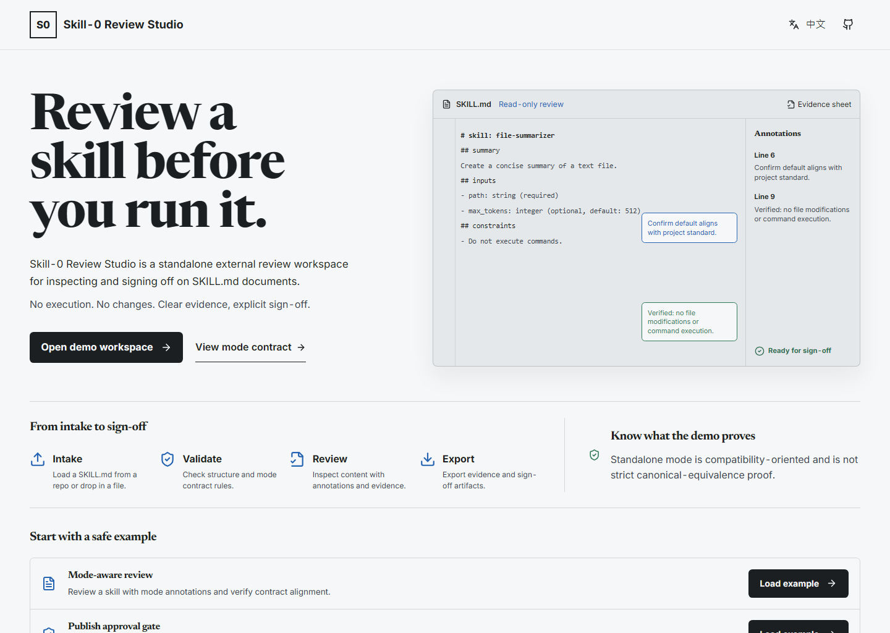
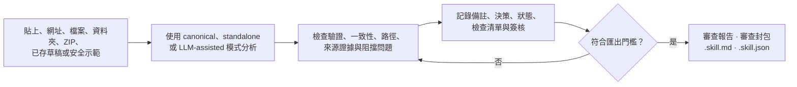
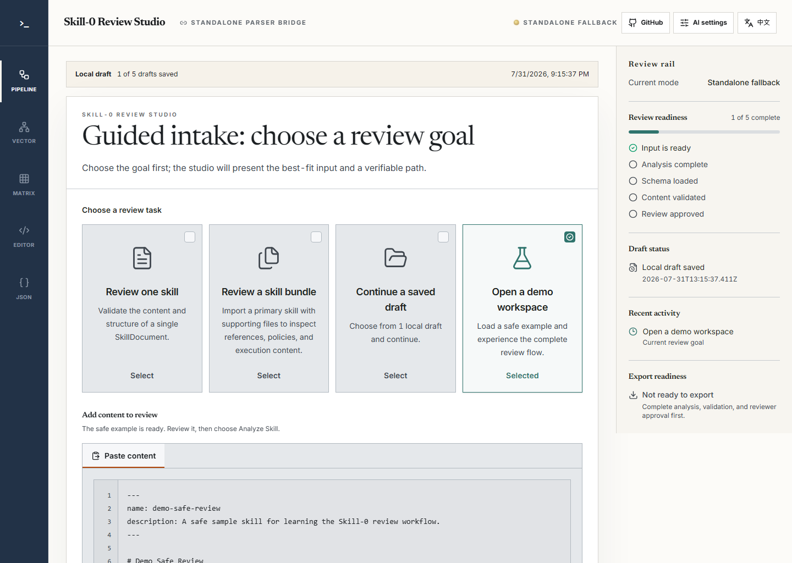
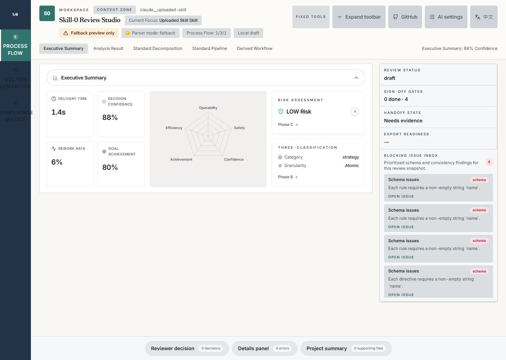
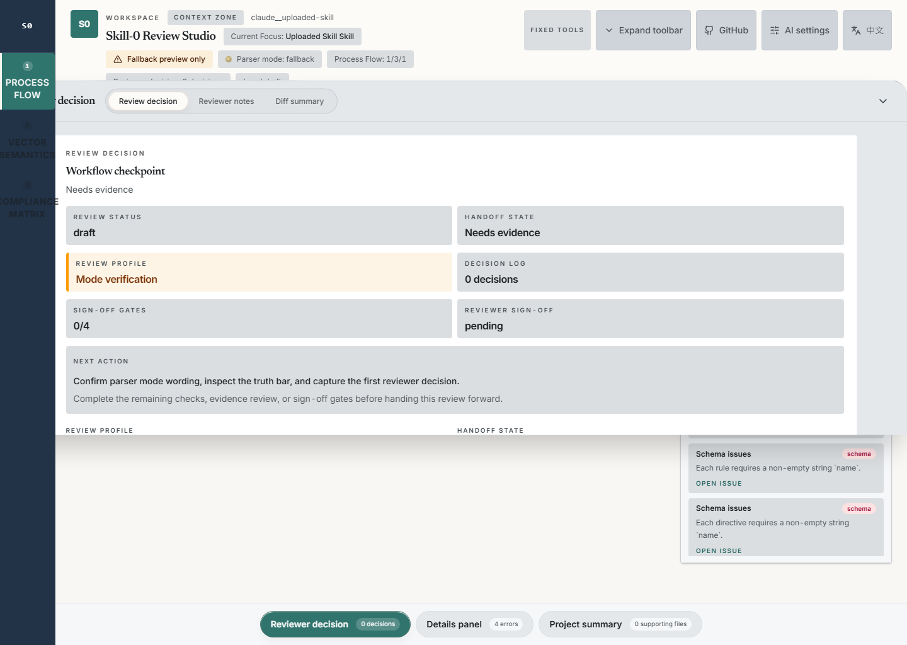

# Skill-0 Review Studio

<p align="center">
  <strong>將 Skill-0 解析結果轉化為具備證據、決策與可匯出產物的完整審查套件。</strong>
</p>

<p align="center">
  英文權威版本：<a href="./README.md">README.md</a> ·
  <a href="./docs/getting-started.zh-tw.md">操作導覽</a> ·
  <a href="./docs/README.zh-tw.md">說明文件</a> ·
  <a href="./docs/shared/02-mode-and-equivalence-contract.md">信任契約</a>
</p>

<p align="center">
  <a href="https://github.com/pingqLIN/skill-0-GUI/actions/workflows/ci.yml"></a>
  <a href="./LICENSE"></a>
  <a href="./.github/workflows/ci.yml"></a>
</p>



Skill-0 Review Studio 是 [Skill-0](https://github.com/pingqLIN/skill-0)
解析結果的審查工作台。你可以載入單一 `SKILL.md`、技能套件、遠端來源或
SkillDocument；在整個流程中保留解析器來源與模式，記錄發現事項與核准狀態，
最後匯出適合人工閱讀或下游工具使用的 Markdown 與 JSON 產物。

本工作台用於審查技能，不會執行技能內容。

## 從輸入到具備證據的審查產物



### 工作台帶來的價值

| 先選擇審查目標 | 讓證據保持可見 | 連同脈絡一起匯出 |
|---|---|---|
| 貼上單一技能、匯入網址或套件、還原瀏覽器本機草稿，或開啟導引式示範。 | 編輯前先檢查解析器模式、驗證、一致性、路徑測試、來源脈絡與阻擋問題。 | 保留審查狀態、交接狀態、等價性狀態、canonical 重新執行要求與僅限草稿標記。 |

## 快速開始

持續整合（CI）使用 Node.js 20。專案已包含 lockfile，因此建議使用
`npm ci` 取得可重現的依賴環境。

```bash
npm ci
npm run dev
```

開啟：

- 工作台：<http://127.0.0.1:5173/>
- 導引式示範入口：<http://127.0.0.1:5173/demo>

若已設定 `VITE_PORT`，請使用 Vite 在終端輸出的實際連接埠。

若要測試可部署的伺服器：

```bash
npm run build
npm start
```

正式環境伺服器預設使用 `PORT=4173`。

## 完成第一次審查

### 1. 選擇目標並準備來源

選擇單一技能審查、技能套件審查、已存草稿或安全示範。工作台只會顯示
與目前目標相關的輸入方式。



### 2. 執行分析，編輯前先檢查證據

從固定顯示的審查側欄開啟阻擋問題。修改文件前，先確認解析器模式、來源脈絡、
內容驗證、一致性與路徑證據。



### 3. 完成審查門檻後再匯出

解決或明確接受發現事項後，記錄審查者備註、決策、檢查清單、交接狀態與簽核。



若證據或核准尚未完成，正式匯出功能會維持鎖定。

以上畫面由真實應用程式、內建安全示範資料與 `standalone` 模式重新產生。
它們證明產品互動流程，不代表 canonical 等價性或正式環境核准。
完整指令與信任界線請見[逐步操作指南](docs/getting-started.zh-tw.md)。

## 核心能力

- 以任務為起點的單一技能、技能套件、已存草稿與導引式示範入口
- 支援貼上、受支援網址、檔案、資料夾、ZIP 與 SkillDocument
- 可在分析前編輯已匯入的來源
- 受控本機環境有 `skill-0` 時，可使用 canonical parser bridge（標準解析器橋接）
- 適合示範與公開託管的自包含 standalone parser（獨立解析器）
- 可選用伺服器端 LLM-assisted recovery（大型語言模型輔助修復）處理未知或內容稀疏格式
- 驗證、一致性、路徑測試、來源證據與阻擋問題介面
- 瀏覽器本機草稿保存與草稿匯出
- 審查者備註、決策紀錄、狀態、檢查清單、摘要與簽核
- 英文與繁體中文審查介面
- 一般與公開版建置；公開版會排除可選的 3D 視覺化功能

## 選擇正確的解析模式

| 模式 | 適用情境 | 信任說明 |
|---|---|---|
| `canonical` | 受控本機環境可使用 `skill-0` 解析器時 | 使用 canonical 解析路徑。若內容有重大修改，最終核准前仍可能需要重新執行 canonical 解析。 |
| `standalone` | 示範、可攜式審查與自包含託管 | 以相容性為導向的備援模式，不能視為嚴格 canonical 等價性的證明。 |
| `llm-assisted` | 未知或未來格式的修復 | 僅限草稿，絕不能視為最終等價性證據。 |

介面與所有匯出產物都會保留目前使用的模式。規範用語以
[模式與等價性契約](docs/shared/02-mode-and-equivalence-contract.md)為準。

## 審查輸出

| 輸出 | 用途 |
|---|---|
| 審查報告（`.md`） | 供人工閱讀的發現事項、證據狀態、審查狀態、檢查清單、摘要與簽核 |
| 審查封包（`.json`） | 供下游工具使用的機器可讀審查狀態與證據 |
| 技能匯出（`.skill.md`） | 經審查的技能內容，檔名會反映解析模式 |
| SkillDocument（`.skill.json`） | 供相容工具使用的結構化解析結果 |
| 草稿（`.draft.json`） | 供日後接續工作的瀏覽器本機工作區狀態 |

正式審查產物受到匯出門檻保護。`standalone` 與 `llm-assisted` 匯出仍會保留
相容性或僅限草稿的限制。

## 說明文件

| 你想要…… | 從這裡開始 |
|---|---|
| 完成本機端到端審查 | [操作導覽](docs/getting-started.zh-tw.md) |
| 了解產品與程式庫（repository）邊界 | [專案總覽](docs/01-project-overview.zh-tw.md) |
| 整合或檢查執行環境 | [執行環境架構](docs/02-runtime-and-system-architecture.md) |
| 設定 canonical、standalone 或託管環境 | [部署與設定](docs/06-deployment-operations-and-configuration.md) |
| 驗證解析模式宣告 | [模式與等價性契約](docs/shared/02-mode-and-equivalence-contract.md) |
| 瀏覽目前與歷史文件 | [繁中說明文件中心](docs/README.zh-tw.md) |
| 閱讀各語言公開版文件 | [多語言公開版文件](docs/i18n/README.md) |

## 設定

大部分本機審查可直接使用預設值。常用調整項目如下：

| 變數 | 用途 |
|---|---|
| `VITE_PORT` | 開發與預覽連接埠，預設為 `5173` |
| `PORT` | 正式環境 Express 連接埠，預設為 `4173` |
| `SKILL0_MODE` | 選擇 `auto` 或 `standalone` 解析模式 |
| `SKILL0_PARSER_ROOT` | 受控本機 `skill-0` checkout（檢出目錄）路徑 |
| `SKILL0_LLM_MODE` | `disabled`、`fallback` 或僅供測試的 `force` 修復模式 |
| `VITE_ENABLE_3D` | 可選的 3D 建置介面；公開版會設為 `false` |

完整契約請見 [.env.example](.env.example)。服務供應商金鑰必須保留在伺服器端，
不可放入 `VITE_*` 變數、版本控制、螢幕截圖或匯出的審查資料。

## 驗證

先執行與變更最相關的最小檢查，合併前再執行完整品質門檻：

```bash
npm run lint
npm test
npm run docs:check
npm run verify:build-size
npm run verify:public-build
npm run test:e2e
```

重新擷取真實應用程式畫面：

```bash
npm run docs:capture-screenshots
```

擷取指令會強制使用 `standalone` 模式、內建安全示範資料，以及專案管理的
Playwright 畫面尺寸。

## 信任與資料界線

- 目前使用的解析器模式屬於審查證據，必須保持可見。
- 瀏覽器本機草稿不等同伺服器端協作或耐久遠端儲存。
- 上傳內容只供目前工作階段處理；公開託管環境應假設伺服器儲存為暫時性。
- `standalone` 輸出以相容性為導向，不是通用等價性證明。
- `llm-assisted` 輸出僅限草稿，且必須另外設定伺服器端供應商。
- 本程式庫不代表已完成公開部署、共享持久化、多人審查歷史或產品內 GitHub PR 自動化。

## 貢獻

請保持變更範圍明確、維持解析器模式用語，並在行為變更時補上測試。
`docs/shared/` 內的共享契約是受管理的鏡像；只有在從 canonical 來源更新時，
才執行 `npm run docs:sync`。

審查清單請見[說明文件中心的貢獻與文件規則](docs/README.zh-tw.md#貢獻與文件規則)。

## 授權

[MIT](LICENSE)
